# MuSig2-Signer Silent Payment Example (Rust)

Demonstrates a 3-of-3 musig2-signer silent payment workflow following BIP-373, BIP-375. Three parties (Alice, Bob, Charlie) collaborate to send a silent payment using P2TR input shared between the 3 parties, each party contributes partial ECDH shares and then signs the transaction once the output script is computed and verified.

2 PSBT rounds are required by each party for MuSig2 with Silent Payments:
1. Contribute (partial ECDH share + DLEQ proof + pubnonce)
2. Sign (verify output script, produce partial MuSig2 signature)

## Running the Example

Execute the workflow in order:

```bash
# From the rust/ directory
cargo r -p musig2-signer
```

## Details

```mermaid
flowchart TD
PRE["Pre-PSBT
aggregate_musig2_keys([alice_pk, bob_pk, charlie_pk])
 → KeyAggContext + with_unspendable_taproot_tweak()
 → tweaked agg xonly key, P2TR script"]

S1["1. Creator  (BIP-370)
create_psbt(inputs=1, outputs=2)"]

S2["2. Constructor  (BIP-370 v2)
add_inputs  → PSBT_IN_PREVIOUS_TXID, PSBT_IN_OUTPUT_INDEX,
 PSBT_IN_WITNESS_UTXO
add_outputs → PSBT_OUT_AMOUNT, PSBT_OUT_SCRIPT (placeholder)
  PSBT_OUT_SP_INFO (scan_key, spend_key)  [BIP-375]"]

S3["3. Updater  (BIP-370 + BIP-373)
Input: add_input_tap_bip32_derivation → PSBT_IN_TAP_BIP32_DERIVATION
  set_input_musig2_participant_pubkeys → PSBT_IN_MUSIG2_PARTICIPANT_PUBKEYS
Change output: set_output_musig2_participant_pubkeys → PSBT_OUT_MUSIG2_PARTICIPANT_PUBKEYS
  add_output_tap_bip32_derivation → PSBT_OUT_TAP_BIP32_DERIVATION"]

S4["4. Round 1: Contribute  (BIP-327 + BIP-375 ext)
each party independently contributes ECDH share + nonce:
  partial_share = sk_i * scan_key
  dleq_proof proves log_G(pk_i) = log_{scan_key}(partial_share)
  → PSBT_IN_SP_PARTIAL_ECDH_SHARE (0x21, proposed)
  → PSBT_IN_SP_PARTIAL_DLEQ       (0x22, proposed)
  add_musig2_pub_nonce (BIP-327 nonce preprocessing)
  → PSBT_IN_MUSIG2_PUB_NONCE  [BIP-373]"]

S5["5. SP Output Derivation  (BIP-370 + BIP-375)
aggregate partial ECDH shares, verify DLEQs,
sum sk_i * scan_key → agg_sk * scan_key
BIP-352: shared_secret = input_hash * agg_ecdh_share
 → PSBT_OUT_SCRIPT (final P2TR)"]

S6["6. Output Verification  (security step)
each party verifies all DLEQ proofs independently,
sums shares, confirms PSBT_OUT_SCRIPT matches"]

S7["7. Round 2: Partial Signing  (BIP-373 + BIP-327)
sighash = taproot_key_spend_sighash(unsigned_tx, prevouts)
each party: add_musig2_partial_sig(sighash)
  → PSBT_IN_MUSIG2_PARTIAL_SIG  [BIP-373]"]

S8["8. Signature Aggregation  (BIP-327)
aggregate_musig2_sigs → Schnorr signature
  → PSBT_IN_TAP_KEY_SIG  (standard taproot field)"]

S9["9. Transaction Extractor  (BIP-370)
extract_transaction → witness: [schnorr_sig]
verify schnorr_sig against tweaked agg xonly key"]

PRE --> S1 --> S2 --> S3 --> S4 --> S5 --> S6 --> S7 --> S8 --> S9
```



Alice -> Bob -> Charlie
"Compute Output" -> "Charlie Partial Sig"
  Alice -> Bob
  Bob -> Alice
"Signature Aggregation" -> "Finalize" -> "Broadcast"